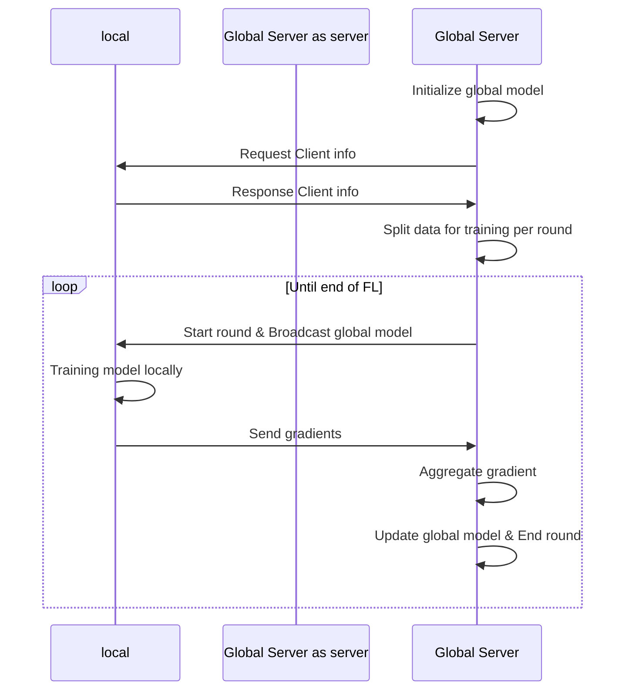

```mermaid
sequenceDiagram
    participant Client as local
    participant Global Server as server
    
    Global Server->>Global Server: Initialize global model
    Global Server->>Client: Request Client info
    Client->>Global Server: Response Client info
    Global Server->>Global Server: Split data for training per round
    loop Until end of FL
    Global Server->>Client: Start round & Broadcast global model
    Client->>Client: Training model locally 
    Client->>Global Server: Send gradients
    Global Server->>Global Server: Aggregate gradient
    Global Server->>Global Server: Update global model & End round
    end
    
```